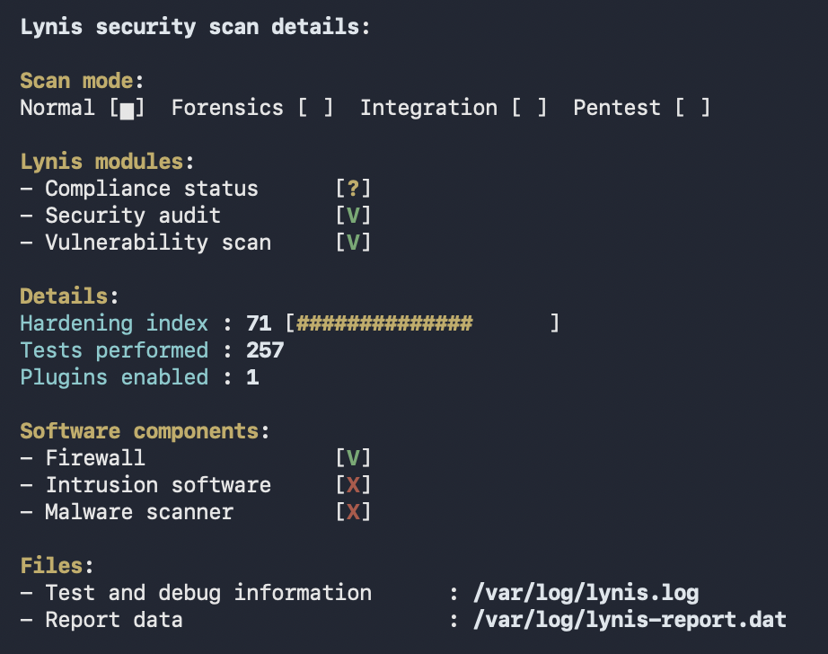

# Linux Baseline OS & Kernel Hardening with Ansible

Automated, idempotent Linux system hardening pipeline targeting CIS (Center for Internet Security) benchmarks for Ubuntu Server (ARM64). This project implements infrastructure as code (IaC) using Ansible to enforce host-level security configurations, kernel defense-in-depth parameters, and access controls.


## Security Audit & Validation (Lynis)

Security posture improvements are benchmarked using Lynis system audits:

| Phase | Hardening Index | Focus Areas | Status |
| :--- | :---: | :--- | :--- |
| **Baseline** | `61` | Stock Ubuntu Server installation | Initial State |
| **OS Hardening** | `71` | Kernel (`sysctl`), SSH Daemon, PAM, Filesystem | **Completed** |
| **Auditing and Detection** | `80` | System Auditing (`auditd`), Intrusion Prevention (`fail2ban`), FIM (`aide`), Rootkit Scanning (`rkhunter`) | **Complete** |

<p align="center">
  
</p>


## Implemented Security Controls

### 1. Kernel & Network Stack (`tasks/sysctl.yml`)
* **ASLR Enforcement**: Sets `kernel.randomize_va_space = 2` to prevent deterministic buffer overflow exploitation.
* **Kernel Pointer & Log Protection**: Enforces `kernel.kptr_restrict = 2` and `kernel.dmesg_restrict = 1`.
* **Network Defense-in-Depth**:
  * TCP SYN cookie protection against SYN flood attacks (`net.ipv4.tcp_syncookies = 1`).
  * Reverse Path Filtering (`rp_filter = 1`) to drop spoofed IP packets.
  * Disables ICMP redirect acceptance and packet forwarding.
  * Martian packet logging enabled for anomalous source route detection.

### 2. SSH Daemon Lockdown (`tasks/ssh.yml`)
* Disables direct root login (`PermitRootLogin no`) and blank passwords (`PermitEmptyPasswords no`).
* Enforces key-only authentication by turning off password auth (`PasswordAuthentication no`).
* Sets connection rate limiting (`MaxAuthTries 3`) and idle session termination (`ClientAliveInterval 300`, `ClientAliveCountMax 2`).
* Disables X11 graphical forwarding (`X11Forwarding no`).
* Utilizes configuration validation hooks (`validate: /usr/sbin/sshd -t -f %s`) to prevent service misconfigurations.

### 3. Filesystem Hardening (`tasks/filesystem.yml`)
* **Kernel Module Blacklisting**: Neutralizes unneeded legacy filesystems (`cramfs`, `freevxfs`, `jffs2`, `hfs`, `hfsplus`, `udf`) via `/etc/modprobe.d/` overrides to minimize kernel attack surfaces.
* **Shared Memory Protection**: Hardens `/dev/shm` in `/etc/fstab` with restrictive mount flags: `nodev`, `nosuid`, and `noexec`.

### 4. User Account & PAM Security (`tasks/pam.yml`)
* Installs and configures `libpam-pwquality` for strict password complexity (minimum 14 characters, character diversity enforcement, diff requirements).
* Configures `/etc/login.defs` defaults for password aging (`PASS_MAX_DAYS 90`, `PASS_MIN_DAYS 1`) and restrictive default umasks (`UMASK 027`).

### 5. System Auditing & Accounting (tasks/auditd.yml)
* Deploys auditd and audispd-plugins with persistent buffer management.
* Configures immutable (-e 2) kernel audit rules monitoring modifications to user/group databases (/etc/passwd, /etc/shadow), sudoers privileges, and system locale/network configurations.

### 6. Intrusion Prevention & Detection (tasks/fail2ban.yml)
* Deploys fail2ban integrated with the systemd journal backend.
* Enforces dynamic rate-limiting and automated IP banning on repeated SSH authentication failures.

### 7. File Integrity & Malware Detection (tasks/integrity.yml)
* Deploys AIDE (Advanced Intrusion Detection Environment) for cryptographic file integrity monitoring.
* Configures RKHunter for rootkit, backdoor, and local exploit scanning.
* Installs debsums for verifying system package authenticity against known-good upstream checksums.
* Hardens development toolchains by restricting execution permissions on local compilers (gcc, as, g++) to root only via conditional stat validation.

### 8. Legal Compliance Warning Banners (tasks/banners.yml)
* Deploys authorized access legal notices to /etc/issue (local console) and /etc/issue.net (remote SSH sessions).

## Project Structure

```text
ansible-hardening/
├── ansible.cfg              # Ansible execution settings & privilege escalation
├── inventory.ini            # Target hosts and connection parameters
├── site.yml                 # Master playbook
├── docs/images/             # Audit scans and metric screenshots
└── roles/
    └── security/
        ├── handlers/
        │   └── main.yml     # Service notifications (e.g., sshd reload)
        └── tasks/
            ├── main.yml     # Role execution entry point
            ├── sysctl.yml   # Kernel and network configuration
            ├── ssh.yml      # SSH daemon lockdown
            ├── filesystem.yml # Module blacklisting and mount flags
            ├── pam.yml      # Password quality and aging policies
            ├── auditd.yml   # Linux Audit Subsystem configuration
            ├── fail2ban.yml # Intrusion prevention & transport protocol blocks
            ├── integrity.yml# File integrity monitoring & compiler restrictions
            └── banners.yml  # Legal compliance login warning banners
```


## Getting Started

### Prerequisites
* Target Host: Ubuntu Server 24.04+ (ARM64 / x86_64)
* Control Node: Python 3.10+ with `ansible-core` installed
* Required Collections: `ansible.posix`

### Execution

1. **Clone the repository:**
   ```bash
   git clone [https://github.com/](https://github.com/)<your-username>/ansible-hardening.git
   cd ansible-hardening
   ```
2. **Configure your inventory:**
   Update inventory.ini with your target host connection settings (or use local execution).

3. **Execute the playbook:**
   ```bash
   ansible-playbook -i inventory.ini site.yml
   ```
4. **Verify audit status:**
   ```bash
   sudo lynis audit system --quick
   ```
