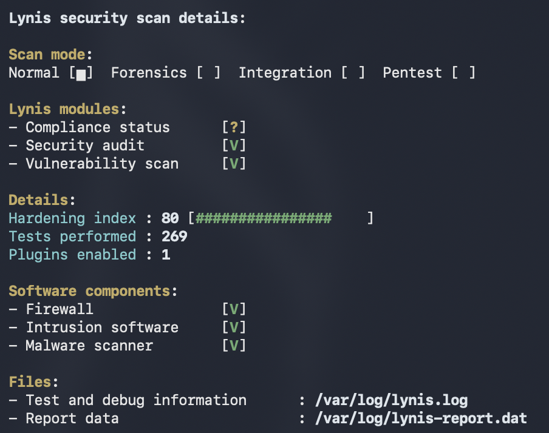

# Linux Baseline OS & Kernel Hardening with Ansible

[](https://github.com/romanmgaranzuay/ansible-linux-hardening/actions/workflows/lint.yml)

Automated, idempotent Linux system hardening pipeline targeting Center for Internet Security (CIS) benchmarks for Ubuntu Server (ARM64 / x86_64).

---

## 📊 Security Audit & Compliance Validation (Lynis)

Security posture improvements are benchmarked using Lynis system audits across sequential hardening milestones:

| Hardening Phase | Lynis Index | Focus Areas | Status |
| :--- | :---: | :--- | :--- |
| **Baseline** | `61` | Stock Ubuntu Server 24.04 LTS installation | Initial State |
| **OS Hardening** | `71` | Kernel (`sysctl`), SSH Daemon (`ssh`), Filesystem mounts (`filesystem`) | Completed |
| **Auditing & Detection** | `80` | Kernel Auditing (`auditd`), Intrusion Prevention (`fail2ban`), FIM (`aide`), Rootkits (`rkhunter`) | **Completed** |

<p align="center">
  
  
</p>

---

## 🛡️ Implemented Security Controls

### 1. Kernel & Network Stack Defense (`tasks/sysctl.yml`)
* **ASLR Enforcement:** Configures `kernel.randomize_va_space = 2` to mitigate memory corruption and buffer overflow exploits.
* **Kernel Pointer & Buffer Restraints:** Enforces `kernel.kptr_restrict = 2` and `kernel.dmesg_restrict = 1` to hide sensitive kernel memory addresses from unprivileged users.
* **Network Defense-in-Depth:**
  * Mitigates SYN flood denial-of-service via `net.ipv4.tcp_syncookies = 1`.
  * Drops spoofed packets via Reverse Path Filtering (`rp_filter = 1`).
  * Disables ICMP redirect acceptance and packet routing forwarding.
  * Enables martian packet logging for source-route anomaly detection.

### 2. SSH Daemon Lockdown (`tasks/ssh.yml`)
* Disables remote root login (`PermitRootLogin no`) and blank passwords (`PermitEmptyPasswords no`).
* Enforces key-based authentication exclusively (`PasswordAuthentication no`).
* Implements connection rate limiting (`MaxAuthTries 3`) and idle session termination (`ClientAliveInterval 300`, `ClientAliveCountMax 2`).
* Disables X11 graphical forwarding (`X11Forwarding no`).
* Utilizes configuration validation hooks (`validate: /usr/sbin/sshd -t -f %s`) to prevent service lockout on syntax errors.

### 3. Attack Surface & Filesystem Hardening (`tasks/filesystem.yml`)
* **Legacy Filesystem Blacklisting:** Disables obsolete filesystems (`cramfs`, `freevxfs`, `jffs2`, `hfs`, `hfsplus`, `udf`) via `/etc/modprobe.d/` overrides to minimize kernel attack surfaces.
* **Shared Memory Isolation:** Restricts `/dev/shm` mounts in `/etc/fstab` with `nodev`, `nosuid`, and `noexec` flags.

### 4. User Authentication & PAM Governance (`tasks/pam.yml`)
* Enforces password entropy via `libpam-pwquality` (minimum 14 characters, character class diversity, history restrictions).
* Establishes password aging thresholds (`PASS_MAX_DAYS 90`, `PASS_MIN_DAYS 1`) and restrictive default umasks (`UMASK 027`) in `/etc/login.defs`.

### 5. Kernel Auditing & System Accounting (`tasks/auditd.yml`)
* Deploys `auditd` and `audispd-plugins` with persistent buffer management.
* Configures immutable (`-e 2`) kernel audit rules monitoring modifications to authentication databases (`/etc/passwd`, `/etc/shadow`), sudoers privileges, and system network configurations.

### 6. Dynamic Intrusion Prevention (`tasks/fail2ban.yml`)
* Integrates `fail2ban` with the `systemd` journal backend.
* Automatically bans offending IPs upon repeated SSH authentication failures to stop brute-force attacks.

### 7. File Integrity Monitoring & Toolchain Lockdown (`tasks/integrity.yml`)
* Deploys **AIDE** (Advanced Intrusion Detection Environment) for cryptographic file integrity monitoring.
* Configures **RKHunter** for automated rootkit, backdoor, and exploit pattern analysis.
* Audits core package authenticity against upstream cryptographic hashes via `debsums`.
* Restricts compiler access (`gcc`, `as`, `g++`) to root execution only.

### 8. Legal Compliance Warning Banners (`tasks/banners.yml`)
* Deploys authorized access legal notices to `/etc/issue` (local console) and `/etc/issue.net` (remote SSH sessions).

---

## ⚙️ Shift-Left CI/CD Pipeline

All Ansible tasks, playbooks, and configuration files are validated continuously on pull requests via GitHub Actions:
* **YAML Linting:** Validates formatting and syntax consistency via `yamllint`.
* **Playbook Syntax Check:** Runs `ansible-playbook --syntax-check` prior to staging.
* **Security & Best Practice Linting:** Enforces modern Ansible standards and catches execution antipatterns using `ansible-lint`.

---

## 📁 Project Structure

```text
ansible-hardening/
├── .github/
│   └── workflows/
│       └── lint.yml           # CI workflow for syntax & security linting
├── ansible.cfg                # Execution settings & privilege escalation
├── inventory.ini              # Target host definitions and transport settings
├── site.yml                   # Master orchestration playbook
├── docs/
│   └── images/                # Audit scan evidence and validation metrics
└── roles/
    └── security/
        ├── handlers/
        │   └── main.yml       # Service notification handlers (e.g., sshd reload)
        └── tasks/
            ├── main.yml       # Primary task execution entry point
            ├── sysctl.yml     # Kernel tuning and network defense
            ├── ssh.yml        # SSH daemon hardening
            ├── filesystem.yml # Filesystem restrictions and module blacklisting
            ├── pam.yml        # PAM policies and password aging
            ├── auditd.yml     # Linux audit subsystem rules
            ├── fail2ban.yml   # Dynamic IP banning rules
            ├── integrity.yml  # AIDE FIM, RKHunter, and compiler restrictions
            └── banners.yml    # Compliance login notices
```

## Takeaways and Tradeoffs 
* **Balancing Security vs. Usability**: Pushing for a 100/100 Lynis score often requires extreme kernel lockdowns that disable essential development tools, and degrade system performance. A Hardening Index of 80 strikes the ideal balance between rigorous enterprise compliance (CIS Level 1) and operational maintainability.

* **Idempotency in Automation**: Designing tasks with validation checks ensures repeated playbook runs enforce baseline state without service interruptions or configuration drift.


## Try it yourself

### Prerequisites
* Target Host: Ubuntu Server 24.04+ (ARM64 / x86_64)
* Control Node: Python 3.10+ with `ansible-core` installed
* Required Collections: `ansible.posix`

### Execution Steps:

1. **Clone the repository:**
   ```bash
   git clone https://github.com/<your-username>/ansible-hardening.git
   cd ansible-hardening
   ```
2. **Configure your inventory:**
   ```text
   Update inventory.ini with your target host connection settings (or use local execution).
   ```

3. **Execute the playbook:**
   ```bash
   ansible-playbook -i inventory.ini site.yml
   ```
4. **Initialize Host Integrity Baselines**
   ```bash
   sudo aideinit && sudo cp /var/lib/aide/aide.db.new /var/lib/aide/aide.db
   sudo rkhunter --propupd
   ```
5. **Verify audit status:**
   ```bash
   sudo lynis audit system --quick
   ```
